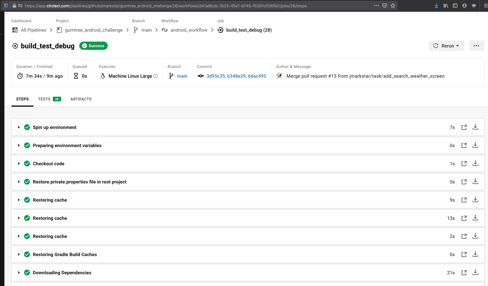
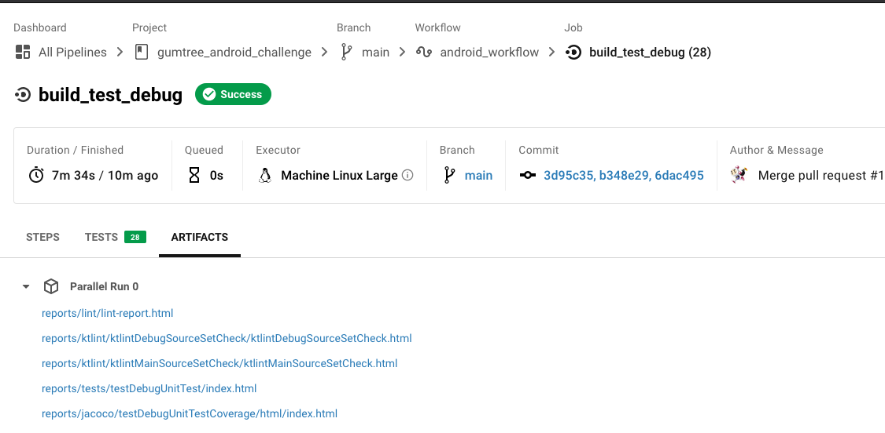
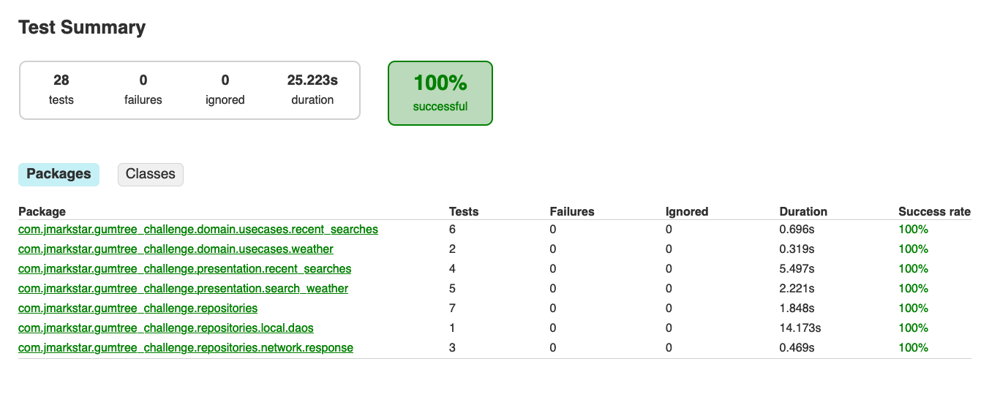
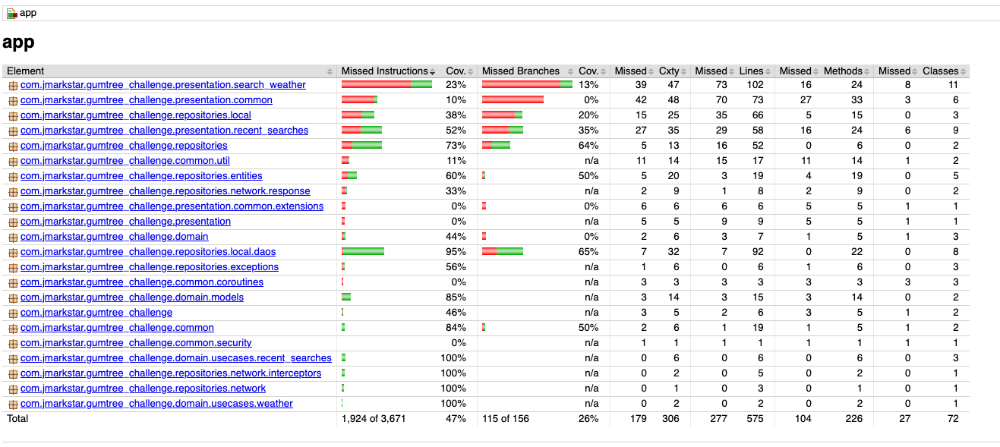
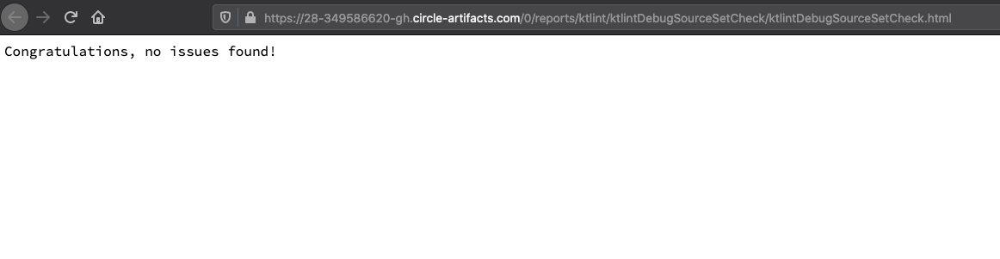
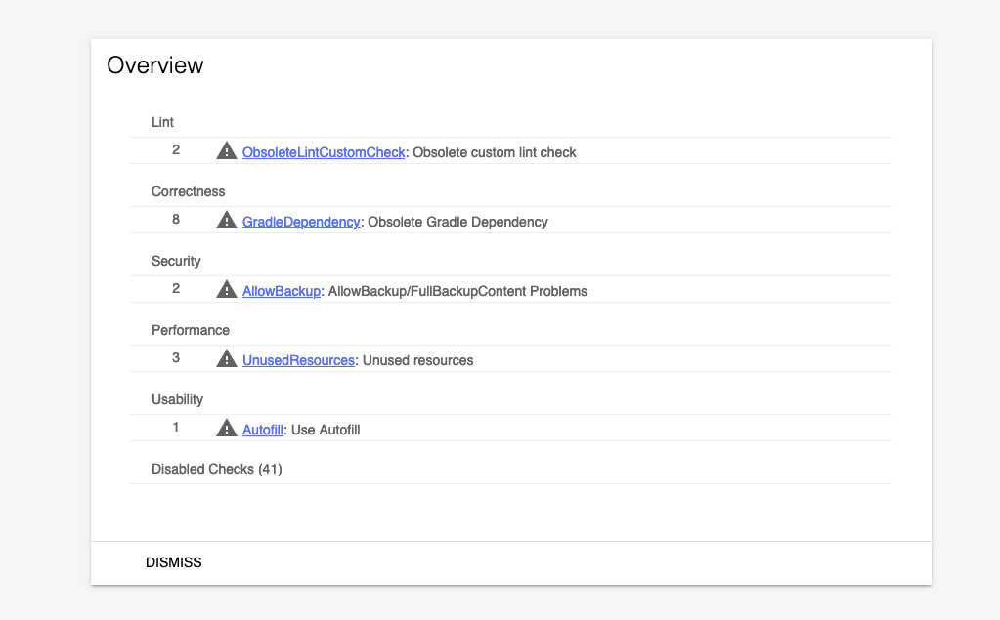

# gumtree_android_challenge

## Setup

- Checkout
- Create `private.properties` file in the root folder of the project.
- Add these properties:

```
# openweathermap api key
api.key.development=YOUR_API_KEY
api.key.production=YOUR_API_KEY
```

- Run the project

## Run the project

You can simply can use the script run.sh

- $./run.sh

But if you need permissions, just run `chmod`

- $sudo chmod 755 ./run.sh
- $./run.sh

# ShowCase


# REPORTS

I've been using `Circle CI` and these are the reports I can show

## Success last execution



Artifacts


## Unit test: Junit 4


## Code Coverage: JaCoCo


## Ktlint: for kotlin static code analysis


## Lint

